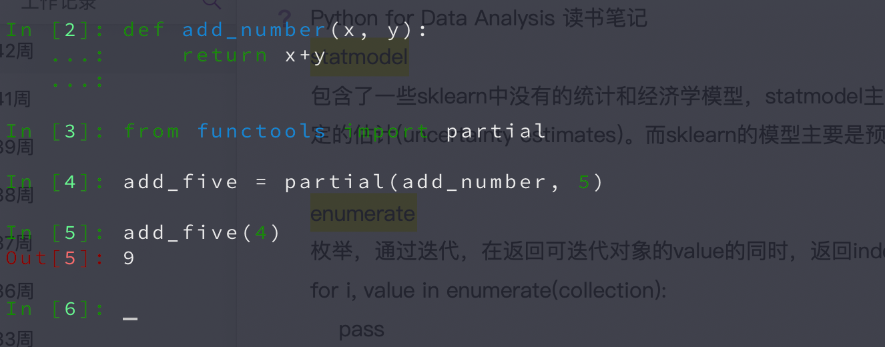
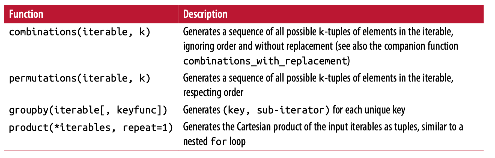

# Python for Data Analysis

Last Edited: Oct 19, 2018 5:28 PM
Tags: 阅读笔记

# statmodel

包含了一些sklearn中没有的统计和经济学模型，statmodel主要是统计推断，做一些不确定的估计(uncertainty estimates)。而sklearn的模型主要是预测

# enumerate

枚举，通过迭代，在返回可迭代对象的value的同时，返回index，例如:

    for i, value in enumerate(collection):
        pass

上面的代码中，value是collection中的所有值，而i是该值在collection中对应的index

# 正则表达式

常用的通配符，常用的Python方法, [脑图](https://app.yinxiang.com/shard/s72/nl/16799747/f32845ad-ee66-4228-8de7-ef1265134a51/)

[正则表达式.xmind](-284db2b2-8e71-4210-b012-f961617a7de1.xmind)

正则表达式

# partial函数

partial函数的作用是利用一个函数构建另外一个函数，比如：

# itertools moudle

itertools模块有一些比较好用的方法：

[欢迎回来](https://app.yinxiang.com/shard/s72/nl/16799747/7dd951a8-1e55-41a4-9473-064315b85488/)

脑图